<!-- Os cartões SVG desta versão estão na raiz do repositório. -->

<a href="https://portfolio-frontend-jet-zeta.vercel.app/"></a>

<a href="https://linkedin.com/in/pedro-henrique-b0a015391">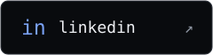</a>

<a href="https://github.com/pedrhenriqueol/paystream-gateway"></a>
<a href="https://github.com/pedrhenriqueol/portlog-os"></a>
<a href="https://github.com/pedrhenriqueol/spectr-testops"></a>
<a href="https://github.com/pedrhenriqueol?tab=overview"></a>
<a href="mailto:pedrohc.forza@gmail.com"></a>

Perfil e projetos em texto

### Pedro Henrique

Desenvolvedor Full Stack e Analista de QA, graduando em Engenharia de Software na UniFanor Wyden.

- **SETE Tecnologia:** estágio em QA / Testes para logística aduaneira e portuária; SQL Server, Postman e validação de APIs.
- **Qualisoft Sistemas:** estágio em Back-end / Full Stack; Laravel, React, TypeScript, consultas SQL e manutenção de sistemas Delphi.

### Projetos

- **[PayStream Gateway](https://github.com/pedrhenriqueol/paystream-gateway):** Pix e split para marketplaces, com idempotência e webhooks assinados via HMAC-SHA256. fastify · typescript · prisma · postgresql · react.
- **[PortLog OS](https://github.com/pedrhenriqueol/portlog-os):** Manutenção portuária com telemetria IoT, ordens de serviço, SLA e trilha de auditoria. react · typescript · fastify · prisma · postgresql.
- **[SPECTR TestOps](https://github.com/pedrhenriqueol/spectr-testops):** Runner de APIs, validação de contratos e Chaos Lab. Métricas p50, p95 e p99; relatórios de SLA. react · typescript · fastify · framer motion.
- **Retaguarda ERP:** experiência com painéis corporativos, permissões RBAC e bancos relacionais.

[Portfólio](https://portfolio-frontend-jet-zeta.vercel.app/) · [LinkedIn](https://linkedin.com/in/pedro-henrique-b0a015391) · [Email](mailto:pedrohc.forza@gmail.com)

Visual inspirado no perfil de <a href="https://github.com/vitorcgo/vitorcgo">vitorcgo</a>; cartões e gerador personalizados. Ícones: <a href="https://simpleicons.org">Simple Icons</a>.
