<!-- Gerado por .github/scripts/build_readme.py. Configuração: assets/profile.json. -->

<a href="https://portfolio-frontend-jet-zeta.vercel.app/"></a>

<a href="https://linkedin.com/in/pedro-henrique-b0a015391">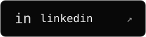</a>

<a href="https://github.com/pedrhenriqueol/paystream-gateway"></a>
<a href="https://github.com/pedrhenriqueol/portlog-os"></a>
<a href="https://github.com/pedrhenriqueol/spectr-testops"></a>
<a href="https://github.com/pedrhenriqueol?tab=overview"></a>
<a href="mailto:pedrohc.forza@gmail.com"></a>

